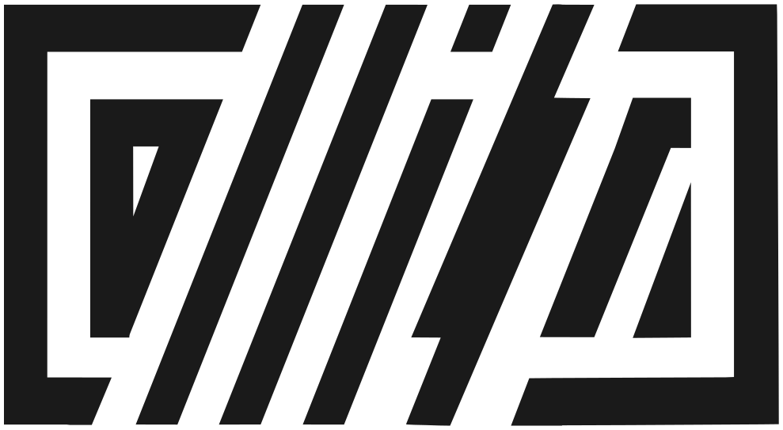

<div align="center">
  <picture>
    <source media="(prefers-color-scheme: dark)" srcset="assets/logo-callisto-white.svg" />
    
  </picture>

  <p align="center">
    
    
    
    
    
  </p>

  <p align="center">
    <a href="https://www.behance.net/CallistoArtwork"></a>
    <a href="https://demozoo.org/sceners/57855/"></a>
    <a href="https://www.linkedin.com/in/frederique-charton"></a>
  </p>

  <p align="center">
    <i>Site vitrine statique de Frédérique Charton (CALLISTO) — graphisme digital, demoscene, vidéo, outils créatifs et IA.</i><br>
    Site <a href="https://callistoarts.com">callistoarts.com</a> · Dépôt <a href="https://github.com/GamePartsOnline/Portfolio-Callisto">GamePartsOnline/Portfolio-Callisto</a>
  </p>
</div>

---

## Aperçu technique

- **Stack :** HTML, CSS, JavaScript (sans framework de build obligatoire).
- **Galerie :** `assets/images/portfolio_images.json` + fichiers sous `assets/images/` (chemins relatifs au site).
- **Textes optionnels :** `content.json` (sections About / Contact, chargement HTTP).
- **Déploiement :** **GitHub Pages** — un `git push` sur `main` publie le site. Procédure dans [`docs/DEPLOY.md`](docs/DEPLOY.md), DNS et TLS dans [`docs/HOSTING.md`](docs/HOSTING.md).

---

## Lancer en local

Le navigateur doit servir le site en **HTTP(S)** : en ouvrant `index.html` en `file://`, le chargement du JSON portfolio est bloqué ou dégradé.

```bash
chmod +x start-server.sh
./start-server.sh
```

Ou, par exemple :

```bash
python3 -m http.server 8080
```

Puis ouvrir `http://127.0.0.1:8080` (ou le port affiché).

---

## Structure du dépôt (résumé)

```
├── index.html              # Page unique
├── styles.css              # Styles
├── script.js               # Portfolio, filtres, lightbox, hero, mode nuit…
├── content.json            # Textes About/Contact (optionnel)
├── assets/images/          # JSON galerie + images par catégorie
├── assets/videos/webm/     # Démos WebM optionnelles (voir docs/MEDIA_WEBM.md)
├── assets/icons/           # Icônes « Software » (SVG)
├── docs/                   # Documentation ([INDEX.md](docs/INDEX.md))
└── scripts/                # Utilitaires (miniatures WebP, index Markdown…)
```

Détail : [`docs/STRUCTURE.md`](docs/STRUCTURE.md).

---

## Contenu et maintenance

| Besoin | Document |
|--------|----------|
| Ajouter ou modifier une œuvre | [`docs/GUIDE.md`](docs/GUIDE.md) |
| Vidéos démo légères (WebM vs YouTube) | [`docs/MEDIA_WEBM.md`](docs/MEDIA_WEBM.md) |
| Suivi galerie / tâches | [`docs/TODO.md`](docs/TODO.md) |
| Analyse fonctionnelle du site | [`docs/SITE.md`](docs/SITE.md) |
| Piste d’évolution (ex. Rails) | [`docs/ROADMAP.md`](docs/ROADMAP.md) |

Scripts Python / shell à la racine et dans `scripts/` : génération de vignettes WebP, synchronisation JSON, etc. (voir [`docs/GUIDE.md`](docs/GUIDE.md)).

---

## Fonctionnalités notables (v2)

- Hero avec carousel alimenté par le même JSON que la grille.
- Portfolio filtrable ; **filtre par défaut « Graphics »** pour limiter le chargement initial (onglet « All » pour tout voir).
- Lightbox (image ou **vidéo WebM** locale si présente, sinon iframe YouTube), timeline « Journey », mode nuit, accessibilité (ARIA, clavier, `prefers-reduced-motion`).

---

## Licence

© 2026 CALLISTO — Frédérique Charton. Tous droits réservés sur les œuvres et le site.

---

*My fun is DRAWING. ALWAYS. And forever.*
