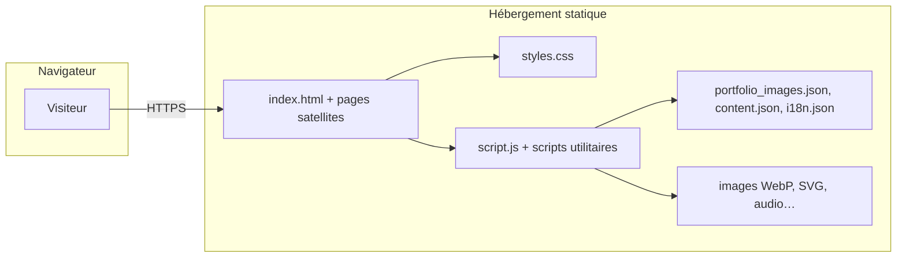

# ARCHITECTURE — Portfolio Callisto Arts

Document centré sur le **site statique en production**. La sécurité par couche est détaillée dans [SECURITY.md](./SECURITY.md) et le guide [securite_sites_internet.md](./securite_sites_internet.md).

---

## Site statique (production actuelle)

**Type** : fichiers servis tels quels (HTML, CSS, JS, images, JSON), **sans runtime serveur** côté site. Hébergement typique : **IONOS mutualisé** — voir [HOSTING.md](./HOSTING.md).

| Couche | Rôle |
|--------|------|
| **Pages** | `index.html` (accueil, sections ancres), `build-log.html`, `services.html`, `mentions-legales.html` |
| **Présentation** | `styles.css` — thème Liquid Glass, responsive, mode « nuit atelier » |
| **Comportement** | `script.js` — portfolio (filtres, grille, lightbox), hero, carrousel, i18n hybride, cookies (avec `cookie-consent.js`) |
| **Données** | `assets/images/portfolio_images.json` (galerie), `content.json` (contact), `i18n.json` (FR/EN) |
| **Réseaux / tiers** | Google Fonts, YouTube en iframe (lightbox), liens externes (Demozoo, Behance, GPO, etc.) |

**Points clés** : pas de base de données, pas de formulaires traités côté serveur sur ce site — la surface d’attaque **application** est limitée au **front** (XSS via contenus injectés si mal gérés, dépendances CDN). Les en-têtes HTTP et TLS relèvent surtout de **l’hébergeur / configuration** — voir [SECURITY.md](./SECURITY.md).

---

## Liens utiles

| Sujet | Document |
|-------|----------|
| Arborescence dépôt | [STRUCTURE.md](./STRUCTURE.md) |
| Sécurité projet | [SECURITY.md](./SECURITY.md) |
| Guide sécurité général (6 couches) | [securite_sites_internet.md](./securite_sites_internet.md) |
| Roadmap | [ROADMAP.md](./ROADMAP.md) |
| Stack / évolutions possibles (hors périmètre ici) | [STACK.md](./STACK.md), [ADMIN.md](./ADMIN.md) |

---

*Révision — Avril 2026*
